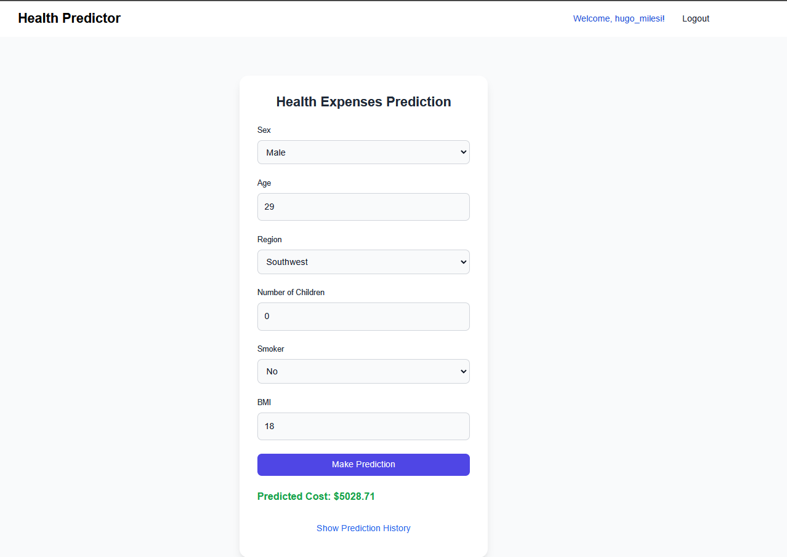

# Health Expenses Prediction


The **Health Expenses Prediction** project is a web-based application designed to predict healthcare expenses based on user inputs such as personal, medical, and demographic data. The goal of this project is to provide insights into potential healthcare costs, enabling users to plan their finances more effectively.

## Key Features
- **User-Friendly Web Interface:** A responsive and modern UI built using Tailwind CSS, ensuring compatibility across devices. It includes interactive forms for data input and visually appealing results.
- **Prediction Functionality:** Leverages machine learning models to predict healthcare costs dynamically displayed on the frontend.
- **User Authentication and Management:** Login and registration pages enable secure access, using Django's built-in authentication system.
- **Data Management:** Processes and stores user inputs securely with Django's ORM. Data models ensure validation and consistency.
- **Backend Logic:** Follows Django's MVC design pattern. Predictions are powered by a pre-trained machine learning model.
- **Logging and Debugging:** Tracks user activity and server performance with comprehensive logging tools.

## Potential Use Cases
- **Individuals:** Estimate healthcare expenses for better financial planning.
- **Insurance Companies:** Provide personalized insurance plans based on predicted expenses.
- **Healthcare Providers:** Assess potential costs for patients with varying profiles.

## Technology Stack
- **Backend:** Django (Python) for server-side logic and database handling.
- **Frontend:** Tailwind CSS for styling and responsive design.
- **Machine Learning:** Pre-trained models integrated for healthcare cost predictions.
- **Database:** SQLite (default for development) for managing user and prediction data.

This application is extendable for future enhancements, such as advanced prediction models, RESTful APIs for programmatic access, and integration with external healthcare data sources for improved accuracy.

If you're interested in exploring how I trained this model, feel free to check it out [HERE](https://colab.research.google.com/drive/1NUn-YsSQgvVbTY5Z0DSuKXHv1xYNiocC?usp=sharing)

<!-- @import "[TOC]" {cmd="toc" depthFrom=1 depthTo=6 orderedList=false} -->

# How to use
- git clone this repo.
- pip install -r requirements.txt
- ```python health_expenses/manage.py runserver```

# TODO's
- integrate to an online PostGre database. ✅
- Create a CRUD for prediction history management.✅


